# Real Estate Management System Management System

This project was undertaken by [Hardik Aggarwal](https://www.github.com/hardik-kgp) under the guidance of Prof. Sudip Mishra for the course Software Engineering Laboratory (CS29006).

## Objective

The Objective of Real Estate Management System is to provide a user friendly interface for easily maintaining, selling and buying of Real Estate. The Software also aims to provide an medium to facilitate auctions of properties.

## Project
The Real Estate Management System is completely implemented in the JAVA programming language and uses MySQL for database management. It provides an extremely interactive and user-friendly GUI for the various users of the system. It is also extremely flexible and can easily extend its scope beyond its intended purpose. The simplicity of the implementation makes it extremely fast and robust, while taking care not to lose its sophistication in the process. It also focuses on providing an exhaustive list of features that makes the buying and selling processes of the various properties very smooth.

# Build Instructions

- Setting up User
	* Open Up mysql in terminal and login as root.
	Run the following command to create a new user : - 
	 > CREATE USER 'hardik'@'localhost' IDENTIFIED BY 'agghardik';
	 > GRANT ALL PRIVILEGES ON * . * TO 'hardik'@'localhost';
- Now a new user has been created.

- Now login as this user
	- $ mysql -u hardik -p (enter password as 'agghardik')
- Now run the setup.sql file to setup the database of the project. 

- Now you can build the project in Apache Netbeans and run it.
## Features

- Provides two levels of provileges - Admin and Customer. 
    
    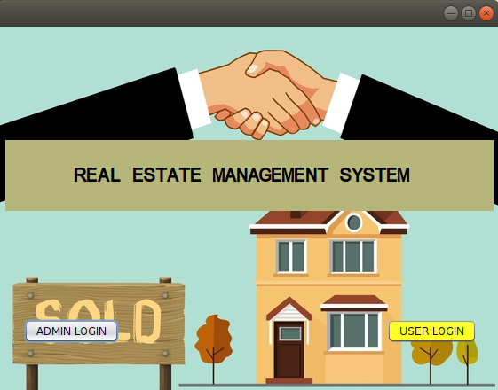

- The Admin corresponds to the main operator of this software who has administrative access and has the power to delete existing users, modifying circle rates and approving auctions.

    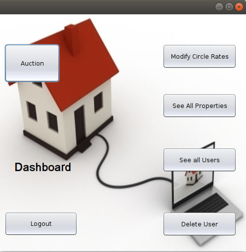

- The Customer corresponds to the user of this software who wants to add and sell properties or participate in an ongoing auction.

    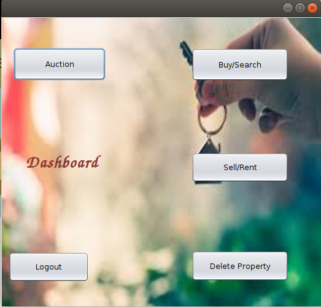

- We have two different logins available. Admin and Customer.

    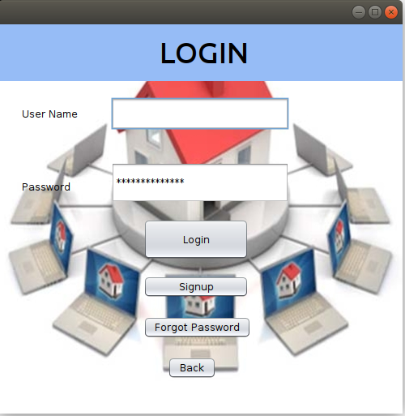
    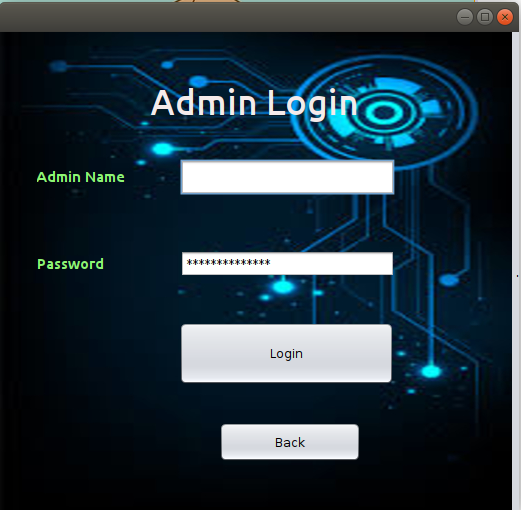

- Their is a Option for signing up into the software if the account does not exist or forgot password if one forgets password.

    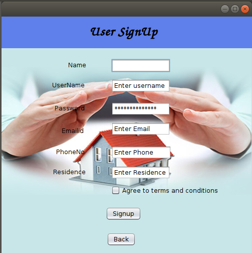
    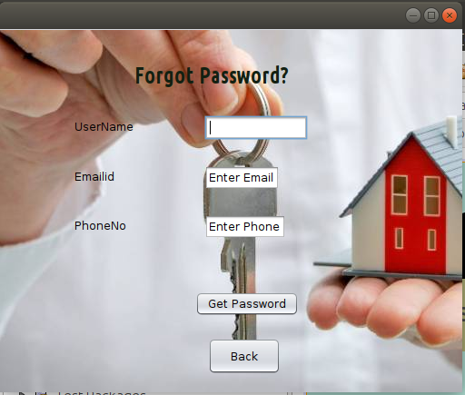

- The Add Property feature allows one to add a property specifying its area, cost, location etc.

    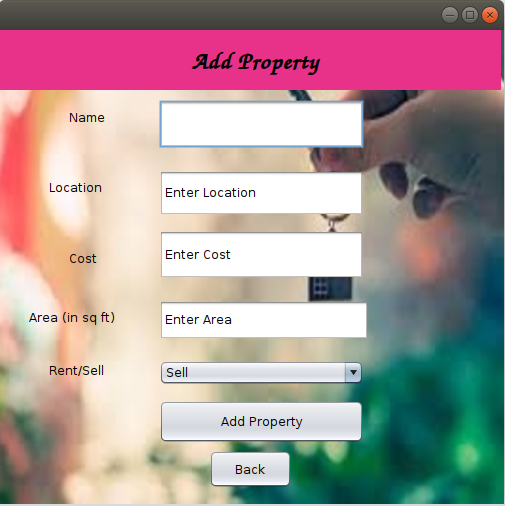 

- The Show Property allows one to look for properties and get details of owners of the properties they want to buy or rent.

    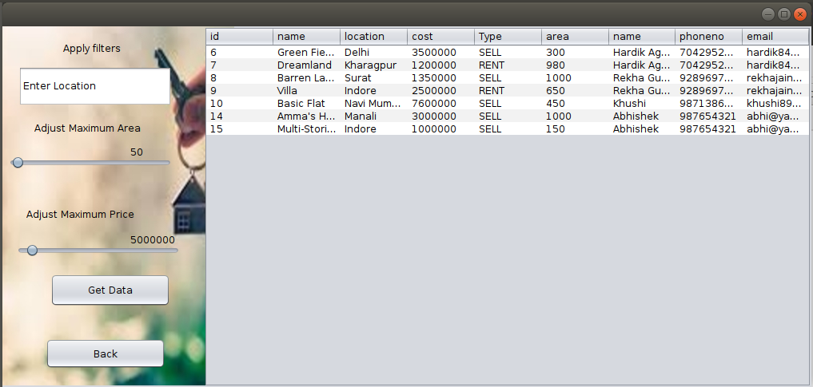

- The Auction feature enables a user to add his property as an Auction object after getting approval from Admin or even place his bid into an ongoing auction

    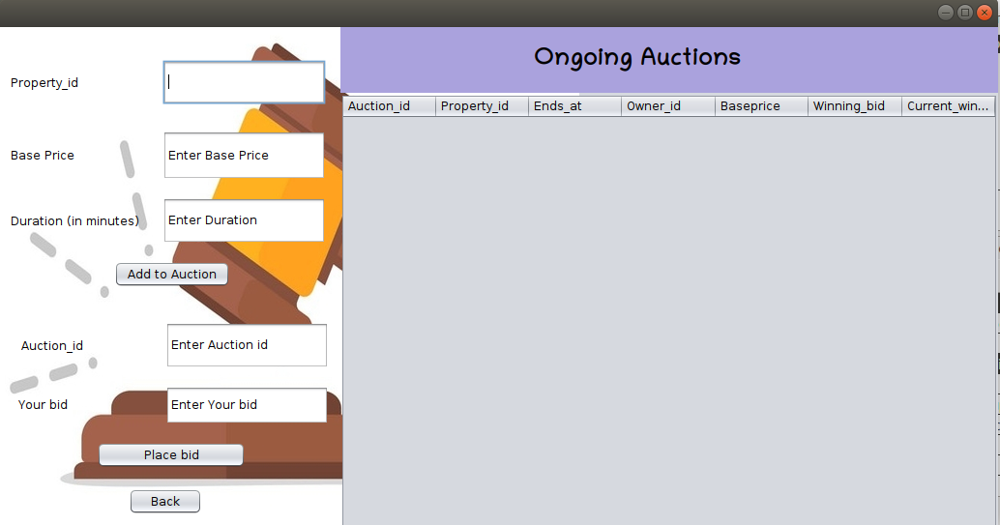
    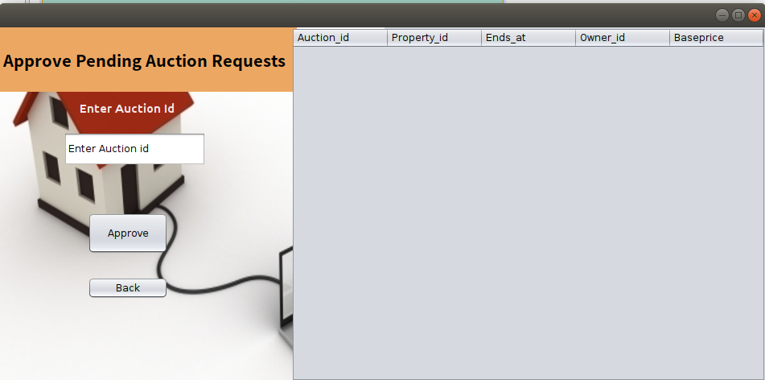

- The user also has an option to delete one of his existing properties by entering the its property id
    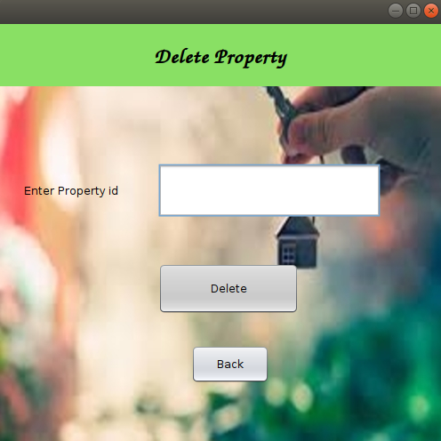

- The Admin has an option to see details and delete of user Accounts by entering the its user id
    

- The user also has an option to delete one of his existing properties by entering the its property id
    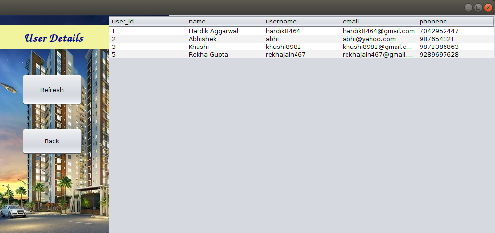
    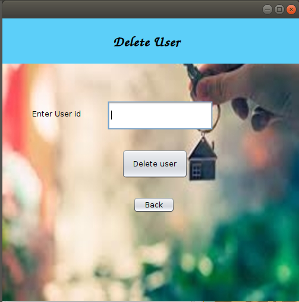

## Scope

The Real Estate Management System can be deployed as an desktop application for all the users and groups who want to experience an user friendly experience while making deals related to their properties. The database can be accessed using the local network. The actual logistics are yet to be taken care of, after which, the app can be released for commercial use.

## Further Extension

 A lot of other facilities, such as sending confirmation emails, limiting number of auctions, enhancing security, making it more interactive, etc. can be accommodated into the application.
